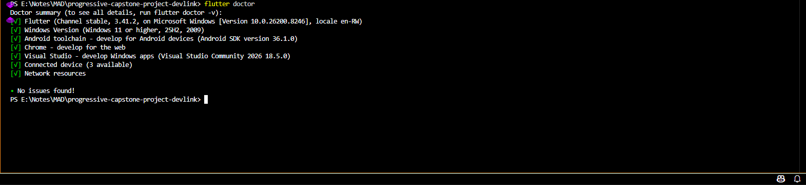

# PreLoved Market

**A Second-Hand Fashion Marketplace for Campus Students**

PreLoved Market is a mobile app that connects students within the campus community to buy and sell second-hand fashion items. It solves the problem of students relying on chance encounters with street hawkers, unreliable WhatsApp posts, and Instagram thrift pages — where sizing is uncertain, product visibility is poor, and there is no trust mechanism between buyers and sellers.


## Team Information

| Item | Details |
|------|---------|
| **Team Name** | DevLink |
| **Course** | Mobile Application Development (MAD) — Level 3 |
| **University** | University of Rwanda |

### Team Members & Contributions

- **Asifiwe Afisa Uwitonze**  Project Lead, UI/UX Designer
  - Field research & user interview (Emmanuel)
  - DESIGN.md and Google Stitch mockups
  - Section A: Dart fundamentals (helpers.dart, dummy_data.dart)
  - Section B: Data models (BaseModel, Product, Searchable mixin, ProductService)
  - Section C: App theme, HomeScreen, ProductDetailScreen, custom widgets
  - Project setup (fonts, assets, pubspec configuration)
  - GitHub repository management

- **Diane Uwamariya** — Research Lead, Documentation Lead
  - Field research & user interview (Kaneza Devine)
  - Section B: Data models (User, Review, Rateable mixin)
  - Section D: Navigation setup (main.dart, named routes, data passing)
  - Section D: AddListingScreen form with validation
  - Video demo coordination


## Problem Statement

Students at campus face significant challenges when buying and selling second-hand fashion items due to the lack of a centralized, reliable platform. Current methods — street hawkers, Instagram thrift pages, and WhatsApp groups — lead to trust issues, difficulty finding specific items, inability to verify size and fit, poor product visibility, and no quality assessment.


## How to Run the App

### Prerequisites
- Flutter SDK (3.7.0 or later)
- Android Studio or VS Code with Flutter extension
- Android emulator or physical device

### Steps
```bash
# 1. Clone the repository
git clone https://github.com/Pelino-Courses/progressive-capstone-project-devlink.git
cd preloved_market

# 2. Install dependencies
flutter pub get

# 3. Verify your setup
flutter doctor

# 4. Run the app
flutter run
```

### Flutter Doctor Screenshot



## Repository Structure

```
preloved_market/
├── lib/
│   ├── main.dart                        # App entry point + named routes (D1)
│   ├── theme/
│   │   └── app_theme.dart               # Material Design 3 theme from DESIGN.md (C4)
│   ├── models/
│   │   ├── base_model.dart              # Abstract base class (B3)
│   │   ├── product.dart                 # Product model with Searchable mixin (B1, B2)
│   │   ├── user.dart                    # User model with Rateable mixin (B1, B2)
│   │   ├── review.dart                  # Review model (B1, B2)
│   │   └── enums.dart                   # ProductCategory, ProductCondition enums
│   ├── mixins/
│   │   ├── searchable.dart              # Search functionality mixin (B3)
│   │   └── rateable.dart                # Rating calculation mixin (B3)
│   ├── services/
│   │   └── product_service.dart         # Async data service with Future.delayed (B5)
│   ├── data/
│   │   └── dummy_data.dart              # Sample data with List, Map, Set (A3)
│   ├── utils/
│   │   └── helpers.dart                 # Dart fundamentals demo (A1-A4)
│   ├── widgets/
│   │   └── product_card.dart            # Reusable ProductCard + ConditionBadge (C3)
│   └── screens/
│       ├── home_screen.dart             # Home screen with product grid (C1, C2)
│       ├── product_detail_screen.dart   # Product detail with seller info (C2, D2)
│       └── add_listing_screen.dart      # Listing form with validation (D3, D4)
├── assets/
│   └── images/                          # Product images
├── fonts/
│   ├── Poppins-Regular.ttf
│   ├── Poppins-Medium.ttf
│   ├── Poppins-SemiBold.ttf
│   └── Poppins-Bold.ttf
├── design/
│   ├── 01_home_screen.png               # Stitch mockup: Home
│   ├── 02_detail_screen.png             # Stitch mockup: Product Detail
│   └── 03_form_screen.png               # Stitch mockup: Add Listing Form
├── docs/
│   ├── field_research.md                # Field research from progressive project
│   ├── app_concept.md                   # App concept document
│   └── team_charter.md                  # Team charter and roadmap
├── wireframes/                          # Original wireframe sketches
├── DESIGN.md                            # Design system: colors, typography, rationale
├── pubspec.yaml
└── README.md
```

## Mini-Capstone Snapshot — Parts A–D

This section summarizes what was added for the Mini-Capstone submission.

### Section A — Dart Fundamentals
- **A1:** Variables with `final`, `const`, `var`; null-safe types using `?`, `!`, `??` (helpers.dart, product.dart, user.dart)
- **A2:** Functions with named parameters, optional parameters, and arrow syntax (helpers.dart, rateable.dart)
- **A3:** `List`, `Map`, and `Set` used in real app data structures (dummy_data.dart)
- **A4:** Control flow with `if/else`, `switch` expressions, ternary operators (helpers.dart, product.dart)

### Section B — OOP & Data Models
- **B1:** 3 domain model classes: `Product`, `User`, `Review`
- **B2:** All models extend abstract `BaseModel` class (inheritance)
- **B3:** `Searchable` mixin on Product, `Rateable` mixin on User, `BaseModel` abstract class
- **B4:** Constructors with named parameters, `required`, and default values
- **B5:** `ProductService` with `async/await` and `Future.delayed` for simulated data loading

### Section C — Flutter UI & Widgets
- **C1:** Home screen displays realistic product data in a two-column grid
- **C2:** Layout widgets: `Column`, `Row`, `Stack`, `ListView.builder`, `GridView.builder`
- **C3:** Custom reusable `ProductCard` and `ConditionBadge` widgets used across multiple screens
- **C4:** Material Design 3 theme with `ColorScheme` mapped from DESIGN.md, Poppins `TextTheme`

### Section D — Navigation & Forms
- **D1:** 3 screens connected via named routes (`/`, `/product-detail`, `/add-listing`)
- **D2:** Product object passed from HomeScreen to ProductDetailScreen via route arguments
- **D3:** Form with `GlobalKey<FormState>`, `TextFormField` validators, `form.validate()` on submit
- **D4:** 7 form fields with meaningful validation (length, format, range, pattern checks)
- **D5:** Back navigation with `Navigator.pop` works correctly on all screens

### Phase 0 — Design Mockups
- 3 Google Stitch mockups in `/design/` folder
- DESIGN.md with full colour palette (hex codes), typography, component styles, and design rationale


## Design System Summary

| Role | Colour | Hex Code |
|------|--------|----------|
| Primary | Forest Green | `#2D6A4F` |
| Primary Container | Soft Sage | `#B7E4C7` |
| Secondary | Warm Terracotta | `#C17754` |
| Background | Warm Linen | `#FDF6EC` |
| Surface | Off White | `#FFFFFF` |
| On Background | Charcoal Brown | `#2C2C2C` |
| Error | Warm Red | `#C0392B` |

**Font:** Poppins (Regular 400, Medium 500, SemiBold 600, Bold 700)

Full design system details are in [DESIGN.md](DESIGN.md).


## MVP Features

| # | Feature | Friction Addressed |
|---|---------|-------------------|
| 1 | Product Listings with Details | Poor visibility, no quality assessment |
| 2 | Search & Filter | No centralized platform, can't find items |
| 3 | Seller Ratings & Reviews | Trust issues, quality assessment |
| 4 | In-App Chat | Size/fit verification |
| 5 | Size Guide & Measurements | Size/fit verification |


## Technologies Used

| Technology | Purpose |
|------------|---------|
| Flutter | Cross-platform mobile app framework |
| Dart | Programming language |
| Material Design 3 | UI component system and theming |
| Google Stitch | AI-powered design mockup generation |
| GitHub | Version control and collaboration |


##  Video Demo

**YouTube Link:** https://youtu.be/m-o-ZCRqgdw

**Video Title Format:** `[MAD] Mini-Capstone Parts A-D — PreLoved Market — Asifiwe Afisa Uwitonze & Diane Uwamariya`


## Submission Details

| Item | Value |
|------|-------|
| **Git Tag** | `mini-capstone-part-a-d` |
| **Commit SHA** | *(run `git rev-parse HEAD` after final commit)* |
| **Repository** | *(your GitHub URL)* |


## AI Tools Acknowledgement

AI tools (Claude) were used to assist with:
- Document structuring and formatting
- Code scaffolding and architecture guidance
- Design system documentation

All core ideas, research, user interviews, and design decisions are original work by the team. Every team member can explain all code in their assigned sections.


